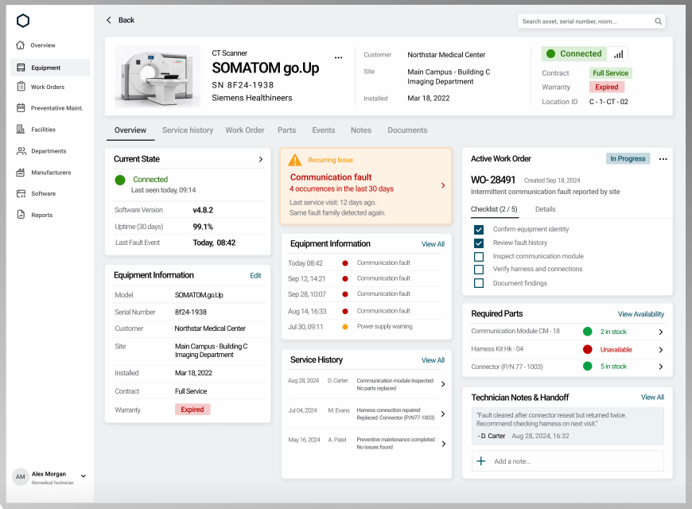

# TaskApp — Design System

> **Arquivo central de design do projeto.** Todo padrão visual, token, componente e tela aprovada é registrado aqui.
> **Regra:** a interface segue **exatamente** o modelo de referência abaixo. Qualquer nova tela reutiliza estes tokens e componentes. Mudanças de design são registradas neste arquivo e no histórico do `PROJETO.md`.

- **Última atualização:** 2026-10-03
- **Referência visual oficial:** [`design_modelo.png`](design_modelo.png) (870 × 640 px, tela desktop "Detalhe do equipamento")



---

## Sumário

1. [Princípios](#1-princípios)
2. [Cores](#2-cores)
3. [Tipografia](#3-tipografia)
4. [Espaçamento, bordas e sombras](#4-espaçamento-bordas-e-sombras)
5. [Layout da aplicação](#5-layout-da-aplicação)
6. [Componentes](#6-componentes)
7. [Tela de referência: Detalhe do equipamento](#7-tela-de-referência-detalhe-do-equipamento)
8. [Ícones](#8-ícones)
9. [Configuração Tailwind](#9-configuração-tailwind)
10. [Mobile](#10-mobile)
11. [Telas](#11-telas)
12. [Histórico de design](#12-histórico-de-design)

---

## 1. Princípios

- **Fidelidade ao modelo:** cores, proporções, hierarquia e componentes iguais à imagem de referência.
- **Fundo cinza claro + cards brancos:** todo conteúdo fica em cards brancos com borda sutil sobre fundo `#EEF0F2`.
- **Cor com significado:** verde = ok/disponível, vermelho = falha/indisponível/expirado, laranja = alerta, azul petróleo = ação/estado em andamento. Cor nunca é decorativa.
- **Densidade de informação alta, leitura fácil:** pares rótulo (cinza) × valor (preto), linhas separadas por divisores finos.
- **Ações discretas:** links "View All"/"Edit" em azul petróleo no canto superior direito do card; chevrons `›` indicam navegação.

---

## 2. Cores

Cores extraídas por amostragem de pixels da imagem de referência (valores arredondados para tokens).

### 2.1 Neutros

| Token | Hex | Uso |
|---|---|---|
| `bg-app` | `#EEF0F2` | Fundo da área de conteúdo |
| `surface` | `#FFFFFF` | Cards, sidebar, campo de busca |
| `sidebar-active` | `#F0F3F4` | Fundo do item ativo do menu lateral |
| `border` | `#E9EBED` | Borda dos cards, divisores verticais do cabeçalho |
| `divider` | `#ECEEF0` | Linhas entre itens de lista, linha base das abas |
| `text-primary` | `#111111` | Títulos, valores, item de menu ativo |
| `text-secondary` | `#565656` | Itens de menu inativos, textos de lista |
| `text-muted` | `#84868A` | Rótulos (Customer, Site…), abas inativas, datas secundárias |
| `text-subtle` | `#A0A0A0` | Subtítulo do usuário (cargo) |
| `avatar-bg` | `#DEE0E2` | Fundo do avatar com iniciais |

### 2.2 Marca / ação (azul petróleo)

| Token | Hex | Uso |
|---|---|---|
| `brand-900` | `#001B30` | Logo (hexágono) |
| `brand-700` | `#004E61` | Checkbox marcado, ícone "+", texto do badge "In Progress" |
| `brand-600` | `#266478` | Links "View All", "Edit", "View Availability" |
| `brand-100` | `#C7D8E0` | Fundo do badge "In Progress" |
| `brand-50` | `#EDF2F5` | Fundo da nota do técnico |
| `brand-50-border` | `#E3EAEF` | Borda da nota do técnico |

> **Personalização por tenant:** `brand-*` é a única família que cada empresa pode sobrescrever (cor principal). Status (verde/vermelho/laranja) nunca mudam.

### 2.3 Status

| Token | Hex | Uso |
|---|---|---|
| `success-600` | `#2F8E0A` | Bolinha "Connected", ícone de status ok |
| `success-500` | `#05A147` | Bolinha "em estoque" (Required Parts) |
| `success-700` | `#226A11` | Texto "Connected", "Full Service", "2 in stock" |
| `success-100` | `#D9F0D6` | Fundo dos badges verdes |
| `danger-700` | `#BA0200` | Bolinha de falha, título do alerta, texto "Unavailable"/"Expired" |
| `danger-600` | `#C61714` | Subtítulo do alerta ("4 occurrences…") |
| `danger-100` | `#F5C9CA` | Fundo do badge "Expired" |
| `warning-500` | `#FBA11A` | Ícone de alerta, bolinha de aviso |
| `warning-600` | `#F0AC31` | Rótulo "Recurring Issue" |
| `warning-50` | `#FEF2E5` | Fundo do card de alerta |
| `warning-200` | `#F4DDC7` | Borda do card de alerta |

---

## 3. Tipografia

- **Família:** sans-serif geométrica/grotesca neutra. Usar **Inter** (Google Fonts) com fallback `system-ui, sans-serif`.
- **Escala** (valores para viewport desktop 1440 px; a imagem está reduzida ~1,65×):

| Token | Tamanho / peso | Uso no modelo |
|---|---|---|
| `display` | 28 px / 700 | Nome do equipamento ("SOMATOM go.Up") |
| `heading` | 20 px / 600 | Número da O.S. ("WO-28491") |
| `title` | 16 px / 600 | Títulos de card ("Current State", "Equipment Information") |
| `subtitle` | 16 px / 400 | SN e fabricante no cabeçalho |
| `body` | 14 px / 400 | Valores, itens de checklist, abas |
| `body-strong` | 14 px / 600 | Métricas (v4.8.2, 99.1%) |
| `label` | 13 px / 400, `text-muted` | Rótulos de pares chave-valor |
| `caption` | 12 px / 400 | Datas em listas, nomes em Service History, cargo do usuário |
| `overline` | 13 px / 500 | "CT Scanner", "Recurring Issue" |

- Números de O.S. e códigos (SN, TAG) usam `tabular-nums`.

---

## 4. Espaçamento, bordas e sombras

| Token | Valor |
|---|---|
| Unidade base | 4 px |
| Padding interno do card | 16 px (cabeçalho e corpo) |
| Gap entre cards (grid) | 16 px |
| Altura de linha de lista | 36–40 px, divisor `divider` 1 px |
| Raio do card | 4 px (cantos quase retos) |
| Raio de badge | 2 px |
| Raio do item ativo do menu | 4 px |
| Raio do campo de busca | 4 px |
| Borda do card | 1 px `border` |
| Sombra do card | `0 1px 2px rgba(0,0,0,0.04)` (muito discreta) |
| Bolinha de status | 10 px (lista) / 14 px (Current State e peças) |

---

## 5. Layout da aplicação

```
┌──────────┬──────────────────────────────────────────────────────────┐
│  ⬡ logo  │ ‹ Back                               [Search asset… 🔍]  │  topbar (sem fundo)
│          ├──────────────────────────────────────────────────────────┤
│ Overview │  Cabeçalho da entidade (card largura total)              │
│▌Equipment│──────────────────────────────────────────────────────────│
│ Work Ord.│  Overview  Service history  Work Order  Parts  …         │  abas
│ Prevent. │──────────────────────────────────────────────────────────│
│ Facilit. │  ┌ coluna 1 ┐  ┌ coluna 2 ┐  ┌ coluna 3 ┐                │  grid 3 colunas
│ Departm. │  │ cards    │  │ cards    │  │ cards    │                │
│ Manufac. │  └──────────┘  └──────────┘  └──────────┘                │
│ Software │                                                          │
│ Reports  │                                                          │
│          │                                                          │
│ (AM) Alex│                                                          │
└──────────┴──────────────────────────────────────────────────────────┘
```

### 5.1 Sidebar
- Largura fixa **196 px**, fundo `surface`, borda direita 1 px `border`.
- Logo: hexágono contornado `brand-900`, 24 px, no topo (padding 20 px).
- Itens: ícone de linha 18 px + texto 13 px `text-secondary`, altura 36 px, padding horizontal 12 px, gap 8 px.
- Item ativo: fundo `sidebar-active`, texto e ícone `text-primary`, peso 600.
- Rodapé: avatar circular 32 px (`avatar-bg`, iniciais 12 px 600), nome 13 px 600, cargo `caption` `text-subtle`, chevron `⌄` à direita.

### 5.2 Topbar
- Sem fundo (sobre `bg-app`), altura 48 px.
- Esquerda: `‹ Back` (chevron + texto 14 px `text-primary`).
- Direita: campo de busca 320 px, fundo `surface`, borda `border`, placeholder `caption` `text-muted`, ícone de lupa à direita.

### 5.3 Área de conteúdo
- Padding 16 px, fundo `bg-app`.
- Cabeçalho da entidade: card de largura total.
- Abas logo abaixo, fora de card.
- Grid de 3 colunas iguais (`grid-cols-3 gap-4`), cada coluna é uma pilha vertical de cards (`flex flex-col gap-4`).

---

## 6. Componentes

### 6.1 `AppCard`
Fundo `surface`, borda `border`, raio 4 px, sombra discreta.
- **Cabeçalho:** título `title` à esquerda; à direita, uma destas ações: link (`View All`, `Edit`, `View Availability`) em `brand-600` 13 px, chevron `›`, kebab `⋯` ou badge.
- **Corpo:** padding 16 px; listas ocupam a largura total com divisores.

### 6.2 `KeyValueRow`
Rótulo `label` (`text-muted`) em coluna de ~45 %, valor `body` `text-primary` à direita (alinhado à esquerda na sua coluna). Divisor inferior `divider`. Valores de múltiplas linhas quebram normalmente (ex.: "Main Campus - Building C / Imaging Department").

### 6.3 `StatusBadge`
Retângulo raio 2 px, padding 2 × 8 px, texto 13 px 500.

| Variante | Fundo | Texto | Exemplo |
|---|---|---|---|
| `success` | `success-100` | `success-700` | Full Service |
| `danger` | `danger-100` | `danger-700` | Expired |
| `info` | `brand-100` | `brand-700` | In Progress |

### 6.4 `ConnectionPill`
Pill com borda `border`: bolinha/ícone check `success-600` + texto "Connected" 15 px 600 `success-700` sobre `success-100`; segmento à direita branco com ícone de sinal (barras) `text-primary`.

### 6.5 `StatusDot`
Círculo sólido: `success-600` (ok), `danger-700` (falha/indisponível), `warning-500` (aviso). 10 px em listas de eventos; 14 px em Current State e Required Parts.

### 6.6 `AlertCard` (Recurring Issue)
- Fundo `warning-50`, borda 1 px `warning-200`.
- Linha 1: ícone triângulo de alerta `warning-500` 20 px + "Recurring Issue" `overline` `warning-600`.
- Título `title` `danger-700` ("Communication fault").
- Subtítulo 13 px `danger-600` ("4 occurrences in the last 30 days"), chevron `›` `danger-700` à direita, centralizado verticalmente.
- Rodapé `caption` `text-muted`, 2 linhas.

### 6.7 `EventList`
Linha: data/hora `caption` `text-secondary` (coluna ~40 %) · `StatusDot` 10 px · descrição `caption` `text-secondary`. Divisores entre linhas.

### 6.8 `ServiceHistoryRow`
Três colunas: data `caption` · técnico `caption` · descrição 2 linhas `caption` (linha 1 `text-primary`, linha 2 `text-secondary`) · chevron `›` à direita. Linhas altas (~56 px).

### 6.9 `WorkOrderSummary`
- Número `heading` + "Created Sep 18, 2024" `caption` `text-muted` na mesma linha.
- Descrição `body` `text-secondary`.
- Sub-abas "Checklist (2 / 5)" | "Details": ativa com sublinhado 2 px `text-primary`.

### 6.10 `ChecklistItem`
Checkbox 16 px raio 2 px. Marcado: fundo `brand-700` + check branco. Desmarcado: borda 1,5 px `brand-700`, fundo branco. Texto `body` `text-secondary` 13 px, gap 12 px, altura 28 px, sem divisores.

### 6.11 `PartRow`
Nome da peça `caption` `text-secondary` (coluna ~55 %) · `StatusDot` 14 px · texto de disponibilidade 13 px (`success-700` "2 in stock" / `danger-700` "Unavailable") · chevron `›`. Divisores entre linhas.

### 6.12 `NoteBox`
Fundo `brand-50`, borda `brand-50-border`, raio 4 px, padding 12 px. Texto da nota `caption` `text-secondary` entre aspas; autor "- D. Carter" 13 px 600 + data `caption` `text-muted`.

### 6.13 `AddNoteInput`
Campo com borda `border`, altura 40 px, ícone `+` `brand-700` 18 px à esquerda, placeholder "Add a note…" `caption` `text-muted`.

### 6.14 `Tabs`
Texto 14 px; ativa `text-primary` 500 com sublinhado 2 px `text-primary`; inativas `text-muted`. Linha base 1 px `divider` na largura total. Gap entre abas 24 px.

### 6.15 `EntityHeader`
Card largura total, altura ~140 px, dividido em 3 zonas por divisores verticais 1 px `border`:
1. **Identidade:** foto 120 × 90 px (fundo `bg-app` claro) · tipo `overline` · nome `display` · SN e fabricante `subtitle` · kebab `⋯` ao lado do nome.
2. **Contexto:** `KeyValueRow` sem divisores (Customer, Site, Installed).
3. **Status:** `ConnectionPill` no topo; abaixo, pares Contract / Warranty (com `StatusBadge`) / Location ID.

### 6.16 `MetricRow` (Current State)
Linha de destaque: `StatusDot` 14 px + "Connected" `body` `success-700` + "Last seen today, 09:14" `caption` `text-secondary`. Depois, `KeyValueRow` com valor em `body-strong`.

### 6.17 Componentes de aplicação (derivados dos tokens, 2026-10-03)

Implementados em `web/app/components/` para telas sem modelo visual (login, onboarding, gestão).

| Componente | Regra visual |
|---|---|
| `AppButton` | Altura 40 px, raio 4 px, 14 px 500. `primario`: fundo `brand-700`, texto branco, hover `brand-900`. `secundario`: fundo `surface`, borda `border`. `perigo`: fundo `danger-700`. `link`: texto `brand-600` (como "Edit" do modelo). Carregando: spinner 16 px + opacidade 60 %. |
| `FormField` + `TextInput` / `SelectInput` | Rótulo `label` (13 px `text-muted`) acima; campo 40 px, borda `border`, raio 4 px, foco borda `brand-600`; erro 12 px `danger-700` abaixo. |
| `StatusBadge` | Variantes do 6.3 + `warning` (fundo `warning-50`, borda `warning-200`, texto `warning-600`) e `neutro` (fundo `sidebar-active`, texto `text-secondary`). |
| `AppTabs` | Igual ao 6.14, com contador opcional (badge `brand-100`/`brand-700`). |
| `AppToast` | Canto superior direito, raio 4 px; sucesso `success-100`/`success-700`, erro `danger-100`/`danger-700`; some em 5 s. |
| `ConfirmDialog` | Card central max 448 px sobre overlay preto 30 %; botões Cancelar (secundário) + Confirmar (primário ou perigo). |
| `EmptyState` | Título `title`, mensagem `body` `text-secondary`, ações centralizadas. |
| `AppAvatar` | Igual ao rodapé da sidebar (5.1): círculo `avatar-bg`, iniciais 12 px 600. |
| `BrandLogo` | Logo da empresa (bucket `logos`) ou hexágono contornado `brand-900`. |
| `AuthCard` | Card 400 px centralizado sobre `bg-app`, padding 24 px; logo 28 px + nome da empresa (ou ManutGO) no topo; título 20 px 600. |

---

## 7. Tela de referência: Detalhe do equipamento

Correspondência com o domínio do TaskApp (tela **Equipamento → Visão geral**). Textos da interface em **pt-BR**.

| Área do modelo | Conteúdo no TaskApp |
|---|---|
| Cabeçalho — identidade | Foto, categoria, descrição/TAG, número de série, fabricante (`equipamentos`) |
| Cabeçalho — contexto | Cliente, unidade, data de instalação |
| Cabeçalho — status | Status do equipamento, contrato, garantia, localização |
| Abas | Visão geral · Histórico de serviços · Ordens de serviço · Peças · Eventos · Notas · Documentos |
| Coluna 1 | Estado atual · Informações do equipamento (Editar) |
| Coluna 2 | Alerta de problema recorrente · Eventos (Ver todos) · Histórico de serviços (Ver todos) |
| Coluna 3 | O.S. ativa com checklist · Peças necessárias (Ver disponibilidade) · Notas do técnico (Ver todas) + adicionar nota |

### Menu lateral (mapeamento confirmado em 2026-09-29)

| Modelo | TaskApp |
|---|---|
| Overview | Início (Dashboard) |
| Equipment | Equipamentos |
| Work Orders | Ordens de Serviço |
| Preventative Maint. | Preventivas / Agenda |
| Facilities | Clientes e Unidades |
| Departments | Categorias e Tipos de serviço |
| Manufacturers | Fabricantes |
| Software | Checklists |
| Reports | Relatórios |

---

## 8. Ícones

- Estilo: **contorno (outline)**, traço 1,5 px, cantos arredondados — mesmo estilo do menu lateral do modelo.
- Biblioteca: **Lucide** (`lucide-vue-next`) — equivalentes: `LayoutGrid`/`Home`, `Monitor`, `ClipboardList`, `CalendarCheck`, `Building2`, `Users`, `Factory`, `AppWindow`, `FileText`, `ChevronLeft`, `ChevronRight`, `MoreHorizontal`, `Search`, `TriangleAlert`, `Signal`, `Plus`, `Check`.
- Tamanhos: 18 px (menu), 16 px (inline), 20 px (alerta).

---

## 9. Configuração Tailwind

Tailwind CSS via módulo `@nuxtjs/tailwindcss`.

```js
// tailwind.config.ts — tokens do design.md
export default {
  theme: {
    extend: {
      fontFamily: { sans: ['Inter', 'system-ui', 'sans-serif'] },
      colors: {
        app: '#EEF0F2',
        surface: '#FFFFFF',
        'sidebar-active': '#F0F3F4',
        border: '#E9EBED',
        divider: '#ECEEF0',
        ink: { DEFAULT: '#111111', secondary: '#565656', muted: '#84868A', subtle: '#A0A0A0' },
        avatar: '#DEE0E2',
        brand: {
          50: 'var(--brand-50, #EDF2F5)',
          100: 'var(--brand-100, #C7D8E0)',
          600: 'var(--brand-600, #266478)',
          700: 'var(--brand-700, #004E61)',
          900: 'var(--brand-900, #001B30)',
        },
        success: { 100: '#D9F0D6', 500: '#05A147', 600: '#2F8E0A', 700: '#226A11' },
        danger: { 100: '#F5C9CA', 600: '#C61714', 700: '#BA0200' },
        warning: { 50: '#FEF2E5', 200: '#F4DDC7', 500: '#FBA11A', 600: '#F0AC31' },
      },
      borderRadius: { card: '4px', badge: '2px' },
      boxShadow: { card: '0 1px 2px rgba(0,0,0,0.04)' },
      width: { sidebar: '196px' },
    },
  },
}
```

> `brand-*` usa variáveis CSS para permitir a cor principal de cada tenant (definidas a partir do branding da empresa).

---

## 10. Mobile

O modelo cobre apenas desktop. Regras de adaptação (pendente de modelo visual próprio):

- Sidebar vira **bottom navigation**: `Início | O.S. | Agenda | Clientes | Mais` (definido no escopo).
- Grid de 3 colunas vira **1 coluna**; ordem: cabeçalho → alerta → O.S. ativa → estado atual → demais cards.
- Abas com rolagem horizontal.
- Mesmos tokens, componentes e cores.

---

## 11. Telas

| Tela | Status | Observação |
|---|---|---|
| Detalhe do equipamento (desktop) | ✅ Modelo aprovado | `design_modelo.png` |
| Detalhe do equipamento (mobile) | ⬜ Pendente | Adaptação da seção 10 |
| Login / cadastro | ⬜ Pendente | |
| Onboarding (criar/entrar em empresa) | ⬜ Pendente | |
| Dashboard | ⬜ Pendente | |
| Lista de O.S. | ⬜ Pendente | |
| Detalhe/execução da O.S. | ⬜ Pendente | |
| Agenda | ⬜ Pendente | |
| Clientes / unidades | ⬜ Pendente | |
| Checklists | ⬜ Pendente | |
| Gestão de usuários | ⬜ Pendente | |
| Configurações da empresa | ⬜ Pendente | |

---

## 12. Histórico de design

| Data | Alteração |
|---|---|
| 2026-09-29 | Criação do `design.md` a partir de `design_modelo.png`: tokens de cor (amostrados da imagem), tipografia, layout, 16 componentes, mapeamento da tela de equipamento e do menu. Paleta azul `#2563EB` do escopo original substituída pelo azul petróleo do modelo. |
| 2026-09-29 | Confirmados pelo responsável: fonte Inter, paleta azul petróleo do modelo, mapeamento do menu lateral e textos da interface em pt-BR. |
| 2026-09-29 | Configuração passa a ser só Tailwind CSS (`@nuxtjs/tailwindcss`); Twind removido. |
| 2026-10-03 | Componentes de aplicação derivados dos tokens (seção 6.17): botões, campos, toast, diálogo, estado vazio, avatar, logo, card de autenticação. Tema por empresa: `cor_primaria` gera a família `brand-*` via `color-mix`. |
